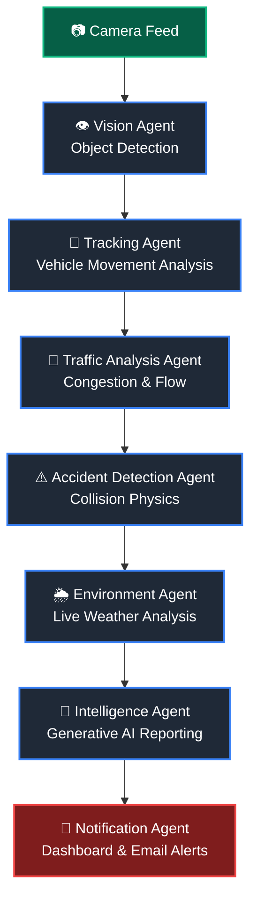

# RoadXpert
### Agentic Autonomous Road Intelligence System


RoadXpert is a multimodal Agentic AI framework designed to autonomously monitor road health, predict infrastructure deterioration, and execute emergency protocols. By fusing edge-based computer vision with a Vision-Language Model (VLM) reasoning engine, RoadXpert transforms standard cameras into autonomous decision-makers.

## 🧠 Agentic Architecture

RoadXpert operates on a continuous **Observe → Reason → Act** loop using three distinct agents:
1. **Perception Agent (Edge):** Uses YOLO11 and object tracking to extract real-time physics (vehicle count, speed, bounding boxes, collision events).
2. **Reasoning Agent (Cloud/VLM):** Synthesizes live traffic data, Open-Meteo weather forecasts, and visual frames. It autonomously calculates a Road Quality Index (RQI) and predicts road failure timelines using deterministic pavement engineering models.
3.  **Accident Detection Agent:** Monitors vehicle motion patterns and detects collision events.
4.  **Environment Agent:** Retrieves weather forecasts and environmental conditions affecting roads.
5. **Execution Agent (System):** Automatically triggers physical and digital actions based on the Reasoning Agent's output. This includes initiating Android phone calls via ADB, sending SMTP email alerts with image attachments, and updating real-time webhooks.

## ⚙️ Prerequisites

* Python 3.8+
* Android SDK Platform-Tools (for ADB auto-calling features)
* A Hugging Face Account (for VLM routing)
* A Gmail Account with "App Passwords" enabled

## 🛠️ Installation & Setup

1. **Clone the repository and install dependencies:**
   ```bash
   git clone https://github.com/Arijit-Rakshit/RoadXpert.git
   cd RoadXpert
   pip install -r requirements.txt
   ```
```
(Ensure opencv-python, flask, ultralytics, requests, python-dotenv, and schedule are in your requirements.txt)
  ```
2. **Environment Variables:**
In .env file in the root directory and add your credentials:
 ```bash
HF_TOKEN=your_huggingface_access_token_here
GMAIL_APP_PASSWORD=your_16_digit_gmail_app_password_here
PORT=5000
 ```
**HuggingFace API Setup**
```
Create an account on HuggingFace.
Go to Settings → Access Tokens.
Generate a new token.
Add it to the .env file.
```
**Gmail Setup for Email Alerts**
RoadXpert AI sends automated reports using Gmail SMTP.
Steps:
```
Enable 2-Step Verification in your Google account.
Go to Google Account → Security → App Passwords.
Create a new App Password for Mail.
Add the generated password to .env.
```
Note: Do not use your normal Gmail password.

3. **Configure the Script:**
Open main.py and update the following variables to match your setup:
```bash
adb_path = Set this to your local ADB executable path (e.g., "Roadxpert\\ADB_CALL" for Windows).
number = Set the emergency contact number (Line 92).
sender =
receiver = Update the email addresses in the send_emergency_email function (Line 383).
```
3. **Hardware Hookup:**
```
(line 928) change this
```
```bash
camera_source = 0
```
```
Connect your webcam (Source 0 is default).
                    or
if you have a video file, Use path for video files (files should be in the same directory as the script)

If using the auto-call feature, connect your Android phone via USB and ensure USB Debugging is enabled in Developer Options. (optional)
```
🚀 How to Run
Start the Agentic Server:
```Bash
python main.py
```
Access the Feed:
```
Open your browser and navigate to ```bash http://localhost:5000/ ```
```
Autonomous Operations:
```
The system will automatically log traffic data to vehicle_log.json.

Click on "Manual Analyze" button on the website to see AI results, 
                          or
(Optional) Uncomment the analyzer_thread at the bottom of main.py to enable the continuous VLM reasoning loop.

At 22:00 daily, the system autonomously generates and emails a comprehensive summary report.

```
## 🔄 System Workflow: Multi-Agent Architecture

The system operates on a decentralized, autonomous agent pipeline. Each specialized agent is responsible for a specific cognitive task, continuously processing and handing off data through the Observe-Reason-Act loop.


## Project Structure
```text
RoadXpert-AI/
├── main.py                # Main Flask server and application entry point
├── traffic.py             # Traffic analysis and congestion detection logic
├── yolo_vehicle.py        # YOLO-based vehicle detection module
├── yolo11n.pt         # YOLO pretrained model for vehicle detection
├── vehicle_log.json   # Vehicle detection logs
├──analysis_log.json  # Structured AI analysis results
├──analysis_log.txt   # Human-readable analysis reports
├── cert.pem           # SSL certificate for secure HTTPS server
├── key.pem            # SSL private key
├── ADB_CALL/          # External API or automation calls
├── static/            # CSS, JS, and frontend assets
├── templates/         # HTML templates for the Flask dashboard
│    └── index.html
├── .env               # Environment variables (API keys, email credentials)
├── requirements.txt       # Python dependencies
└── README.md              # Project documentation
```
    
